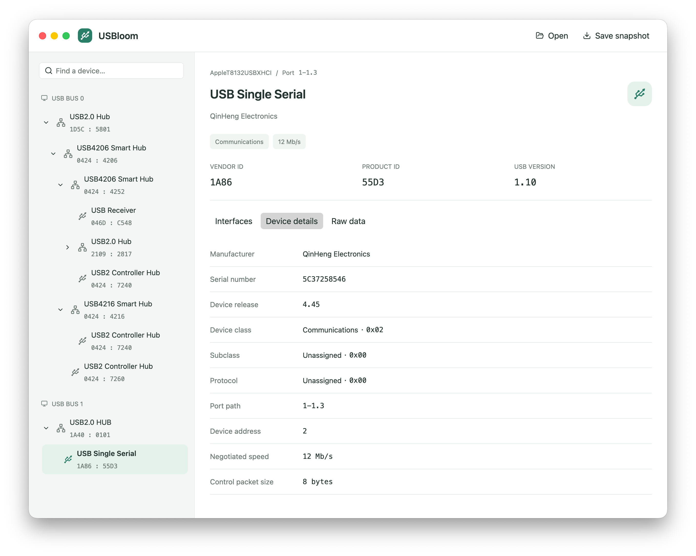

# USBloom

**Explore your USB devices, down to every endpoint.**

USBloom is a native desktop explorer for the moments when “device
connected” is not enough. Follow a board through its hubs, inspect its
interfaces, and understand what each endpoint does.

- Browse the physical USB tree, with search that keeps parent hubs visible.
- See which interfaces a device exposes, with readable class names such as
  Audio, Video, and CDC Data alongside their raw descriptor values.
- Explore configurations, alternate settings, and endpoint details.
- Read transfer direction, packet sizes, and service intervals without
  translating every field by hand. Hover over endpoints for context.
- Watch the tree update automatically when devices connect or disconnect.
- Select and copy device values or JSON. Save a snapshot and open it later,
  even when the hardware is no longer connected.
- Use a light or dark appearance that follows your system.

USBloom observes devices. Choosing a configuration or alternate setting
in the interface does not change the hardware.

## Try it

The first version is in development. macOS is the primary platform;
Windows and Linux are checked by CI but still need hands-on validation.
The first macOS download targets Apple Silicon and is not signed with
Developer ID or notarized. See [installation notes](docs/install-macos.md).
Release downloads will appear on [GitHub Releases](https://github.com/xingrz/usbloom/releases)
when the first version is published. See
[Contributing](CONTRIBUTING.md#run-and-check) to run a local build.

Select a device on the left, then explore **Interfaces**, **Device details**,
or **Raw data**. Device changes appear automatically. **Save snapshot** keeps
the current capture; **Open** browses one offline, and **Connected devices**
returns to the hardware.

Drag over a value to select text, then copy with **⌘/Ctrl C** or the
right-click menu. Right-clicking a value without a selection copies that
value. Field labels stay out of the selection.

| Shortcut | Action |
| --- | --- |
| ⌘/Ctrl F | Find a device |
| ⌘/Ctrl R | Rescan / return to connected devices |
| ⌘/Ctrl S | Save a snapshot |
| ⌘/Ctrl O | Open a snapshot |

Some devices or operating-system permissions prevent full descriptor
reads. USBloom shows unavailable fields rather than guessing. Snapshots
can contain device serial numbers; review them before sharing.

## License

GPL-3.0-or-later. USB inspection is powered by
[cyme](https://github.com/tuna-f1sh/cyme); the native interface uses
[GPUI](https://gpui.rs/) and [GPUI Kit](https://gpui-kit.com/).
